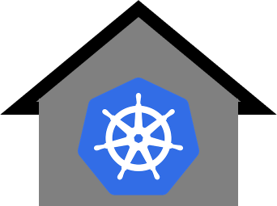
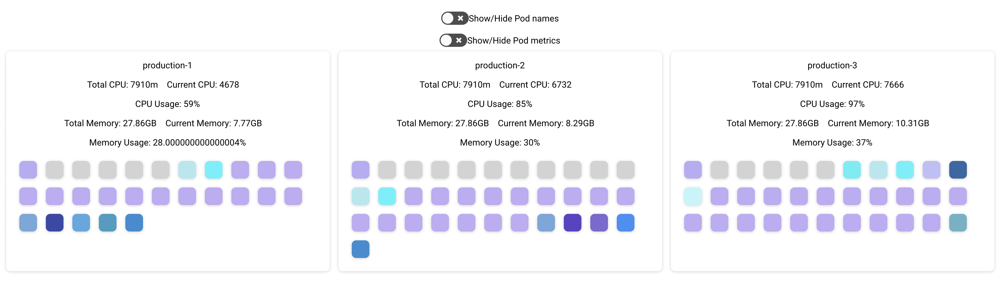

# kuberhaus
> Resource dashboard for kubernetes

<p align="center">
  
</p>

<p align="center">
  
</p>


### Setup

Connect to your desired kubernetes cluster:

```
kubectl config use-context <cluster-name>
```

```
go run main.go
```

Now start the dashboard:

```
cd dashboard

yarn

yarn start
```

# Using Docker

Use existing image `stevelacy/kuberhaus`

`docker run -v ~/.kube/:/root/.kube -p 8282:8282 --name stevelacy/kuberhaus:latest`

Open `http://localhost:8282`

Build image

```sh
docker build -t kuberhaus:latest .
```

Run container and mount config to container
```sh
docker run -v ~/.kube/:/root/.kube -p 8282:8282 --name kuberhaus
```


# Running on kubernetes

Kuberhaus will automatically retrieve the `KUBERNETES_SERVICE_HOST` variable and connect to the parent cluster


`deployment.yaml`

```yaml
apiVersion: apps/v1
kind: Deployment
metadata:
  name: kuberhaus-deployment
  namespace: kube-system
  labels:
    app: kuberhaus
spec:
  replicas: 1
  selector:
    matchLabels:
      app: kuberhaus
  template:
    metadata:
      labels:
        app: kuberhaus
    spec:
      serviceAccountName: cluster-admin
      containers:
      - name: kuberhaus
        image: stevelacy/kuberhaus:latest
        imagePullPolicy: Always
        ports:
        - containerPort: 8282
---
```

`kubectl apply -f deployment.yaml`

Access it with `kubectly port-forward`

`kubectl port-forward -n kube-system kuberhaus-deployment-<id> 8282:8282`

MIT
